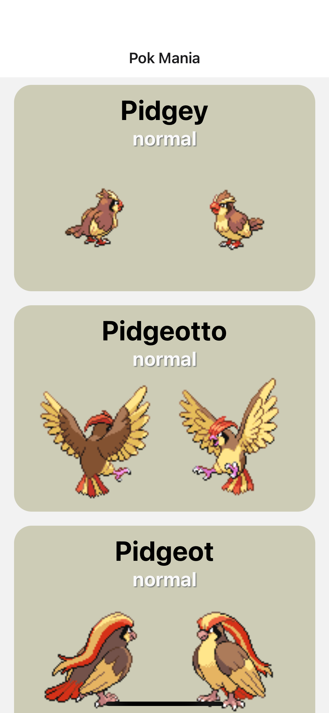
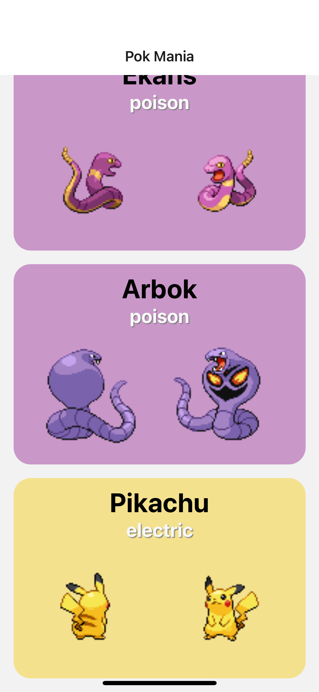
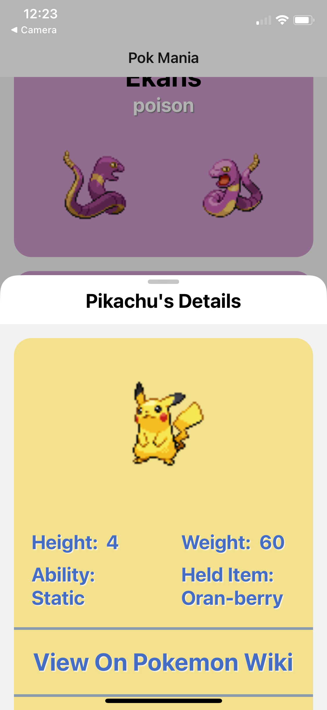
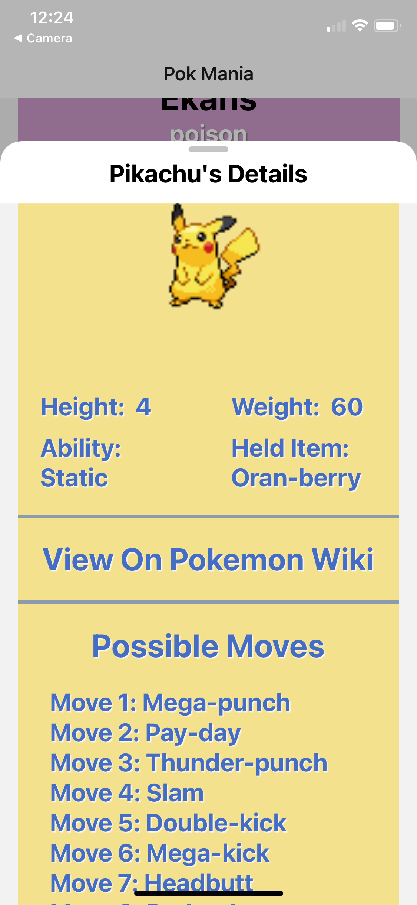

# 📱 Pok Mania

A modern **React Native Pokémon Character Listing** built with **Expo** and **TypeScript** that allows users to browse Pokémon and view detailed information including abilities, held items, and moves via dynamic type-based styling.

---

## ✨ Features

* Browse Pokémon from the PokéAPI
* Dynamic Pokémon detail pages
* Type-based color themes
* Front and back Pokémon sprites
* Ability and held item information
* Complete move lists
* Direct links to each Pokémon's Fandom Wiki page
* Responsive mobile layout
* Built using modern React Native and Expo Router navigation

---

## 🛠️ Tech Stack

| Technology   | Purpose                      |
| ------------ | ---------------------------- |
| React Native | Mobile application framework |
| Expo         | Development platform         |
| TypeScript   | Type safety                  |
| Expo Router  | Navigation & routing         |
| PokéAPI      | Pokémon data source          |

---

## 📸 Screenshots

<p align="center">
   
   
   
   
</p>

---

## 🚀 Getting Started

### Clone the repository

```bash
git clone https://github.com/ernsch777/pok-mania-react-native.git
```

### Install dependencies

```bash
npm install
```

### Start the development server (assumes you have Expo Go installed on your mobile device)

```bash
npx expo start
```

Scan the QR code with **Expo Go** on your mobile device, or launch an iOS or Android simulator.

---

## 🎯 What I Learned

This project was a fun easy one. Written by my hand with some AI assistance for questions and inline autofill. I'm getting accustomed to the differences between React Native from normal React. Pretty easy and straightforward so far. Spent a good amount of time messing with the styling to get it to look just the way I wanted. Flex and other css lines do operate a little differently within RNative. Some things I learned and worked on:

* More React Native Specifics and Screen and formSheet Navigation 
* Expo Go testing and refresh
* TypeScript
* More Basic React Hooks
* API integration using Fetch
* Dynamic routing with Expo Router
* Responsive mobile UI design
* State management
* Conditional rendering
* Flexbox layouts within React Native View boxes
* RNative Link for external links
* Reusable helper functions

---

## 🔮 Future Improvements

* 🔍 Search Pokémon by name
* ❤️ Favorite Pokémon
* 🎨 Filter by Pokémon type
* 🌙 Dark mode
* 🔄 Evolution chains
* ⚡ Performance optimizations and image caching

---

## 🙏 Acknowledgements

* **PokéAPI** for providing the Pokémon data.
* **Pokémon Fandom Wiki** for additional Pokémon information.

---

## 📄 License

This project is available under the **MIT License**.
